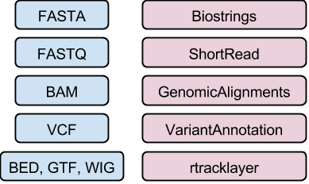

```{r style, echo = FALSE, results = 'asis'}
BiocStyle::markdown()
options(width=100, max.print=1000)
knitr::opts_chunk$set(
    eval=as.logical(Sys.getenv("KNITR_EVAL", "TRUE")),
    cache=as.logical(Sys.getenv("KNITR_CACHE", "TRUE")))
```

```{r setup, echo=FALSE, messages=FALSE, warnings=FALSE}
suppressPackageStartupMessages({
    library(Biostrings)
    library(GenomicRanges)
    library(GenomicFiles)
    library(BiocParallel)
    library(TxDb.Hsapiens.UCSC.hg19.knownGene)
})
```

Author: Martin Morgan (<a
  href="mailto:mtmorgan@fredhutch.org">mtmorgan@fredhutch.org</a>)<br/ >
Date: 7 September, 2015<br />
Back to [Workshop Outline](Developer-Meeting-Workshop.html)<br />

The material in this document requires _R_ version 3.2 and
_Bioconductor_ version 3.1

```{r configure-test}
stopifnot(
    getRversion() >= '3.2' && getRversion() < '3.3',
    BiocInstaller::biocVersion() >= "3.1"
)
```

# _Bioconductor_ 'infrastructure' for sequence analysis

## Classes, methods, and packages

This section focuses on classes, methods, and packages, with the goal
being to learn to navigate the help system and interactive discovery
facilities.

## Motivation

Sequence analysis is specialized

- Large data needs to be processed in a memory- and time-efficient manner
- Specific algorithms have been developed for the unique
  characteristics of sequence data

Additional considerations

- Re-use of existing, tested code is easier to do and less error-prone
  than re-inventing the wheel.
- Interoperability between packages is easier when the packages share
  similar data structures.

Solution: use well-defined _classes_ to represent complex data;
_methods_ operate on the classes to perform useful functions.  Classes
and methods are placed together and distributed as _packages_ so that
we can all benefit from the hard work and tested code of others.

# Core packages

<pre>
                   VariantAnnotation
                           |
                           v
                    GenomicFeatures
                           |
                           v
                       BSgenome
                           |
                           v
                      rtracklayer
                           |
                           v
                    GenomicAlignments
                      |           |
                      v           v
     SummarizedExperiment   Rsamtools  ShortRead
                  |         |      |      |
                  v         v      v      v
                GenomicRanges     Biostrings
                        |          |
                        v          v
               GenomeInfoDb   (XVector)
                        |     |
                        v     v
                        IRanges
                           |
                           v 
                      (S4Vectors)
</pre>

# Core classes

## Case study: _IRanges_ and _GRanges_

The [IRanges][] package defines an important class for specifying
integer ranges, e.g.,
```{r iranges}
library(IRanges)
ir <- IRanges(start=c(10, 20, 30), width=5)
ir
```

There are many interesting operations to be performed on ranges, e.g,
`flank()` identifies adjacent ranges
```{r iranges-flank}
flank(ir, 3)
```

The `IRanges` class is part of a class hierarchy. To see this, ask R for
the class of `ir`, and for the class definition of the `IRanges` class
```{r iranges-class}
class(ir)
getClass(class(ir))
```

Notice that `IRanges` extends the `Ranges` class. Show

Now try entering `?flank` (if not using _RStudio_, enter
`?"flank,<tab>"` where `<tab>` means to press the tab key to ask for
tab completion). You can see that there are help pages for `flank`
operating on several different classes. Select the completion

```{r iranges-flank-method, eval=FALSE}
?"flank,Ranges-method" 
```

and verify that you're at the page that describes the method relevant
to an `IRanges` instance.  Explore other range-based operations.

The [GenomicRanges][] package extends the notion of ranges to include
features relevant to application of ranges in sequence analysis,
particularly the ability to associate a range with a sequence name
(e.g., chromosome) and a strand. Create a `GRanges` instance based on
our `IRanges` instance, as follows
```{r granges}
library(GenomicRanges)
gr <- GRanges(c("chr1", "chr1", "chr2"), ir, strand=c("+", "-", "+"))
gr
```

The notion of flanking sequence has a more nuanced meaning in
biology. In particular we might expect that flanking sequence on the
`+` strand would precede the range, but on the minus strand would
follow it. Verify that `flank` applied to a `GRanges` object has this
behavior.
```{r granges-flank}
flank(gr, 3)
```

Discover what classes `GRanges` extends, find the help page
documenting the behavior of `flank` when applied to a `GRanges` object,

It seems like there might be a number of helpful methods available for
working with genomic ranges; we can discover some of these from the
command line, indicating that the methods should be on the current
`search()` path

```{r granges-methods}
methods(class="GRanges")
```

Notice that the available `flank()` methods have been augmented by the
methods defined in the _GenomicRanges_ package, including those that are relevant (via inheritance) to the _GRanges_ class.

```{r granges-flank-method}
grep("flank", methods(class="GRanges"), value=TRUE)
```

Verify that the help page documents the behavior we just observed.

```{r granges-flank-method-help, eval=FALSE}
?"flank,GenomicRanges-method"
```

Use `help()` to list the help pages in the `GenomicRanges` package,
and `vignettes()` to view and access available vignettes; these are
also available in the Rstudio 'Help' tab.
```{r granges-man-and-vignettes, eval=FALSE}
help(package="GenomicRanges")
vignette(package="GenomicRanges")
vignette(package="GenomicRanges", "GenomicRangesHOWTOs")
```

## _GenomicRanges_

### The `GRanges` and `GRangesList` classes

Aside: 'TxDb' packages provide an R representation of gene models

```{r txdb}
library(TxDb.Hsapiens.UCSC.hg19.knownGene)
txdb <- TxDb.Hsapiens.UCSC.hg19.knownGene
```

`exons()`: _GRanges_

```{r txdb-exons}
exons(txdb)
```


`exonsBy()`: _GRangesList_

```{r txdb-exonsby}
exonsBy(txdb, "tx")
```


_GRanges_ / _GRangesList_ are incredibly useful

- Represent **annotations** -- genes, variants, regulatory elements,
  copy number regions, ...
- Represent **data** -- aligned reads, ChIP peaks, called variants,
  ...

### Algebra of genomic ranges
  
Many biologically interesting questions represent operations on ranges

- Count overlaps between aligned reads and known genes --
  `GenomicRanges::summarizeOverlaps()`
- Genes nearest to regulatory regions -- `GenomicRanges::nearest()`,
  [ChIPseeker][]
- Called variants relevant to clinical phenotypes -- 
  [VariantFiltering][]

_GRanges_ Algebra

- Intra-range methods
    - Independent of other ranges in the same object
    - GRanges variants strand-aware
    - `shift()`, `narrow()`, `flank()`, `promoters()`, `resize()`,
      `restrict()`, `trim()`
    - See `?"intra-range-methods"`
- Inter-range methods
    - Depends on other ranges in the same object
    - `range()`, `reduce()`, `gaps()`, `disjoin()`
    - `coverage()` (!)
    - see `?"inter-range-methods"`
- Between-range methods
    - Functions of two (or more) range objects
    - `findOverlaps()`, `countOverlaps()`, ..., `%over%`, `%within%`,
      `%outside%`; `union()`, `intersect()`, `setdiff()`, `punion()`,
      `pintersect()`, `psetdiff()`


## _Biostrings_ (DNA or amino acid sequences)

Classes

- XString, XStringSet, e.g., DNAString (genomes),
  DNAStringSet (reads)

Methods --

- [Cheat sheat](http://bioconductor.org/packages/release/bioc/vignettes/Biostrings/inst/doc/BiostringsQuickOverview.pdf)
- Manipulation, e.g., `reverseComplement()`
- Summary, e.g., `letterFrequency()`
- Matching, e.g., `matchPDict()`, `matchPWM()`

Related packages

- [BSgenome][]
  - Whole-genome representations
  - Model and custom
- [ShortRead][]
  - FASTQ files

Example 

- Whole-genome sequences are distrubuted by ENSEMBL, NCBI, and others
  as FASTA files; model organism whole genome sequences are packaged
  into more user-friendly `BSgenome` packages. The following
  calculates GC content across chr14.

    ```{r BSgenome-require, message=FALSE}
    library(BSgenome.Hsapiens.UCSC.hg19)
    chr14_range = GRanges("chr14", IRanges(1, seqlengths(Hsapiens)["chr14"]))
    chr14_dna <- getSeq(Hsapiens, chr14_range)
    letterFrequency(chr14_dna, "GC", as.prob=TRUE)
    ```
    
## _GenomicAlignments_ (Aligned reads)

Classes -- GenomicRanges-like behaivor

- GAlignments, GAlignmentPairs, GAlignmentsList

Methods

- `readGAlignments()`, `readGAlignmentsList()`
  - Easy to restrict input, iterate in chunks
- `summarizeOverlaps()`

Example

- Find reads supporting the junction identified above, at position
  19653707 + 66M = 19653773 of chromosome 14

    ```{r bam-require}
    library(GenomicRanges)
    library(GenomicAlignments)
    library(Rsamtools)
    
    ## our 'region of interest'
    roi <- GRanges("chr14", IRanges(19653773, width=1)) 
    ## sample data
    library('RNAseqData.HNRNPC.bam.chr14')
    bf <- BamFile(RNAseqData.HNRNPC.bam.chr14_BAMFILES[[1]], asMates=TRUE)
    ## alignments, junctions, overlapping our roi
    paln <- readGAlignmentsList(bf)
    j <- summarizeJunctions(paln, with.revmap=TRUE)
    j_overlap <- j[j %over% roi]
    
    ## supporting reads
    paln[j_overlap$revmap[[1]]]
    ```

## _VariantAnnotation_ (Called variants)

Classes -- GenomicRanges-like behavior

- VCF -- 'wide'
- VRanges -- 'tall'

Functions and methods

- I/O and filtering: `readVcf()`, `readGeno()`, `readInfo()`,
  `readGT()`, `writeVcf()`, `filterVcf()`
- Annotation: `locateVariants()` (variants overlapping ranges),
  `predictCoding()`, `summarizeVariants()`
- SNPs: `genotypeToSnpMatrix()`, `snpSummary()`

Example

- Read variants from a VCF file, and annotate with respect to a known
  gene model
  
    ```{r vcf, message=FALSE}
    ## input variants
    library(VariantAnnotation)
    fl <- system.file("extdata", "chr22.vcf.gz", package="VariantAnnotation")
    vcf <- readVcf(fl, "hg19")
    seqlevels(vcf) <- "chr22"
    ## known gene model
    library(TxDb.Hsapiens.UCSC.hg19.knownGene)
    coding <- locateVariants(rowRanges(vcf),
        TxDb.Hsapiens.UCSC.hg19.knownGene,
        CodingVariants())
    head(coding)
    ```
  
Related packages

- [ensemblVEP][] 
  - Forward variants to Ensembl Variant Effect Predictor
- [VariantTools][], [h5vc][]
  - Call variants

Reference

- Obenchain, V, Lawrence, M, Carey, V, Gogarten, S, Shannon, P, and
  Morgan, M. VariantAnnotation: a Bioconductor package for exploration
  and annotation of genetic variants. Bioinformatics, first published
  online March 28, 2014
  [doi:10.1093/bioinformatics/btu168](http://bioinformatics.oxfordjournals.org/content/early/2014/04/21/bioinformatics.btu168)

## _rtracklayer_ (Genome annotations)

- `import()`: BED, GTF, WIG, 2bit, etc
- `export()`: GRanges to BED, GTF, WIG, ...
- Access UCSC genome browser

## _SummarizedExperiment_

- Integrate experimental data with sample, feature, and
  experiment-wide annotations
- Matrix where rows are indexed by genomic ranges, columns by a
  DataFrame.


Functions and methods

- Accessors: `assay()` / `assays()`, `rowData()` / `rowRanges()`,
  `colData()`, `metadata()`
- Range-based operations, especially `subsetByOverlaps()`

# Input & representation of standard file formats

## BAM files of aligned reads -- `GenomicAlignments`

Recall: overall workflow

1. Experimental design
2. Wet-lab preparation
3. High-throughput sequencing
4. Alignment
     - Whole genome, vs. transcriptome
5. Summary
6. Statistical analysis
7. Comprehension

BAM files of aligned reads

- Header

        @HD     VN:1.0  SO:coordinate
        @SQ     SN:chr1 LN:249250621
        @SQ     SN:chr10        LN:135534747
        @SQ     SN:chr11        LN:135006516
        ...
        @SQ     SN:chrY LN:59373566
        @PG     ID:TopHat       VN:2.0.8b       CL:/home/hpages/tophat-2.0.8b.Linux_x86_64/tophat --mate-inner-dist 150 --solexa-quals --max-multihits 5 --no-discordant --no-mixed --coverage-search --microexon-search --library-type fr-unstranded --num-threads 2 --output-dir tophat2_out/ERR127306 /home/hpages/bowtie2-2.1.0/indexes/hg19 fastq/ERR127306_1.fastq fastq/ERR127306_2.fastq
  
- Alignments
    - ID, flag, alignment and mate
  
            ERR127306.7941162       403     chr14   19653689        3       72M             =       19652348        -1413  ...
            ERR127306.22648137      145     chr14   19653692        1       72M             =       19650044        -3720  ...
            
    - Sequence and quality
        
            ... GAATTGATCAGTCTCATCTGAGAGTAACTTTGTACCCATCACTGATTCCTTCTGAGACTGCCTCCACTTCCC        *'%%%%%#&&%''#'&%%%)&&%%$%%'%%'&*****$))$)'')'%)))&)%%%%$'%%%%&"))'')%))
            ... TTGATCAGTCTCATCTGAGAGTAACTTTGTACCCATCACTGATTCCTTCTGAGACTGCCTCCACTTCCCCAG        '**)****)*'*&*********('&)****&***(**')))())%)))&)))*')&***********)****
        
    - Tags

            ... AS:i:0  XN:i:0  XM:i:0  XO:i:0  XG:i:0  NM:i:0  MD:Z:72 YT:Z:UU NH:i:2  CC:Z:chr22      CP:i:16189276   HI:i:0
            ... AS:i:0  XN:i:0  XM:i:0  XO:i:0  XG:i:0  NM:i:0  MD:Z:72 YT:Z:UU NH:i:3  CC:Z:=  CP:i:19921600   HI:i:0

- Typically, sorted (by position) and indexed ('.bai' files)

[GenomicAlignments][]

- Use an example BAM file (`fl` could be the path to your own BAM file)

    ```{r genomicalignments}
    ## example BAM data
    library(RNAseqData.HNRNPC.bam.chr14)
    ## one BAM file
    fl <- RNAseqData.HNRNPC.bam.chr14_BAMFILES[1]
    ## Let R know that this is a BAM file, not just a character vector
    library(Rsamtools)
    bfl <- BamFile(fl)
    ```
- Input the data into R

    ```{r readgalignments}
    aln <- readGAlignments(bfl)
    aln
    ```

    - `readGAlignmentPairs()` / `readGAlignmentsList()` if paired-end
      data
    - Lots of things to do, including all the _GRanges_ /
      _GRangesList_ operations
      
    ```{r galignments-methods}
    methods(class=class(aln))
    ```

- **Caveat emptor**: BAM files are large. Normally you will
  _restrict_ the input to particular genomic ranges, or _iterate_
  through the BAM file. Key _Bioconductor_ functions (e.g.,
  `GenomicAlignments::summarizeOverlaps()` do this data management
  step for you. See next section!

## Other formats and packages



# Large data -- `BiocParallel`, `GenomicFiles`

## Restriction

- Input only the data necessary, e.g., `ScanBamParam()`
- `which`: genomic ranges of interest
- `what`: 'columns' of BAM file, e.g., 'seq', 'flag'

## Iteration

- Read entire file, but in chunks
- Chunk size small enough to fit easily in memory, 
- Chunk size large enough to benefit from _R_'s vectorized operations
  -- 10k to 1M records at at time
- e.g., `BamFile(..., yieldSize=100000)`

Iterative programming model

- _yield_ a chunk of data
- _map_ input data to convenient representation, often summarizing
  input to simplified form
    - E.g., Aligned read coordinates to counts overlapping regions of
      interest
    - E.g., Aligned read sequenced to GC content
- _reduce_ across mapped chunks
- Use `GenomicFiles::reduceByYield()`

    ```{r iteration}
    library(GenomicFiles)

    yield <- function(bfl) {
        ## input a chunk of alignments
        library(GenomicAlignments)
        readGAlignments(bfl, param=ScanBamParam(what="seq"))
    }
    
    map <- function(aln) { 
        ## Count G or C nucleotides per read
        library(Biostrings)
        gc <- letterFrequency(mcols(aln)$seq, "GC")
        ## Summarize number of reads with 0, 1, ... G or C nucleotides
        tabulate(1 + gc, 73)                # max. read length: 72
    }
    
    reduce <- `+`
    ```

- Example

    ```{r iteration-doit}
    library(RNAseqData.HNRNPC.bam.chr14)
    fls <- RNAseqData.HNRNPC.bam.chr14_BAMFILES
    bf <- BamFile(fls[1], yieldSize=100000)
    gc <- reduceByYield(bf, yield, map, reduce)
    plot(gc, type="h",
         xlab="GC Content per Aligned Read", ylab="Number of Reads")
    ```

## Parallel evaluation

- Cores, computers, clusters, clouds
- Generally, requires memory management techniques like restriction or
  iteration -- parallel processes competing for shared memory
- Many problems are _embarassingly parallel_ -- `lapply()`-like --
  especially in bioinformatics where parallel evaluation is across
  files

- Example: GC content in several BAM files

    ```{r parallel-doit}
    library(BiocParallel)
    gc <- bplapply(BamFileList(fls), reduceByYield, yield, map, reduce)

    library(ggplot2)
    df <- stack(as.data.frame(lapply(gc, cumsum)))
    df$GC <- 0:72
    ggplot(df, aes(x=GC, y=values)) + geom_line(aes(colour=ind)) +
        xlab("Number of GC Nucleotides per Read") +
        ylab("Number of Reads")
    ```

[biocViews]: http://bioconductor.org/packages/BiocViews.html#___Software
[AnnotationData]: http://bioconductor.org/packages/BiocViews.html#___AnnotationData

[aprof]: http://cran.r-project.org/web/packages/aprof/index.html
[hexbin]: http://cran.r-project.org/web/packages/hexbin/index.html
[lineprof]: https://github.com/hadley/lineprof
[microbenchmark]: http://cran.r-project.org/web/packages/microbenchmark/index.html

[AnnotationDbi]: http://bioconductor.org/packages/AnnotationDbi
[BSgenome]: http://bioconductor.org/packages/BSgenome
[BiocParallel]: http://bioconductor.org/packages/BiocParallel
[Biostrings]: http://bioconductor.org/packages/Biostrings
[CNTools]: http://bioconductor.org/packages/CNTools
[ChIPQC]: http://bioconductor.org/packages/ChIPQC
[ChIPpeakAnno]: http://bioconductor.org/packages/ChIPpeakAnno
[DESeq2]: http://bioconductor.org/packages/DESeq2
[DiffBind]: http://bioconductor.org/packages/DiffBind
[GenomicAlignments]: http://bioconductor.org/packages/GenomicAlignments
[GenomicRanges]: http://bioconductor.org/packages/GenomicRanges
[IRanges]: http://bioconductor.org/packages/IRanges
[KEGGREST]: http://bioconductor.org/packages/KEGGREST
[PSICQUIC]: http://bioconductor.org/packages/PSICQUIC
[rtracklayer]: http://bioconductor.org/packages/rtracklayer
[Rsamtools]: http://bioconductor.org/packages/Rsamtools
[ShortRead]: http://bioconductor.org/packages/ShortRead
[VariantAnnotation]: http://bioconductor.org/packages/VariantAnnotation
[VariantFiltering]: http://bioconductor.org/packages/VariantFiltering
[VariantTools]: http://bioconductor.org/packages/VariantTools
[biomaRt]: http://bioconductor.org/packages/biomaRt
[cn.mops]: http://bioconductor.org/packages/cn.mops
[h5vc]: http://bioconductor.org/packages/h5vc
[edgeR]: http://bioconductor.org/packages/edgeR
[ensemblVEP]: http://bioconductor.org/packages/ensemblVEP
[limma]: http://bioconductor.org/packages/limma
[metagenomeSeq]: http://bioconductor.org/packages/metagenomeSeq
[phyloseq]: http://bioconductor.org/packages/phyloseq
[snpStats]: http://bioconductor.org/packages/snpStats

[org.Hs.eg.db]: http://bioconductor.org/packages/org.Hs.eg.db
[TxDb.Hsapiens.UCSC.hg19.knownGene]: http://bioconductor.org/packages/TxDb.Hsapiens.UCSC.hg19.knownGene
[BSgenome.Hsapiens.UCSC.hg19]: http://bioconductor.org/packages/BSgenome.Hsapiens.UCSC.hg19
